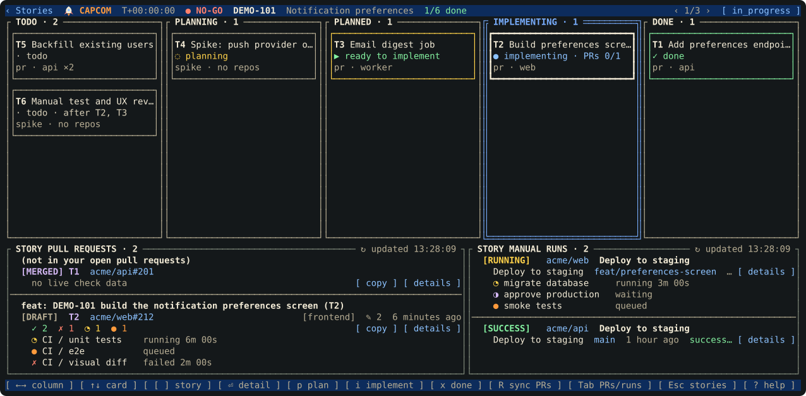
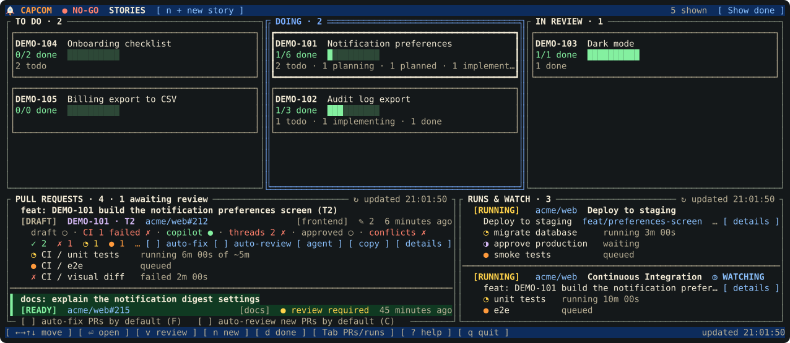

# capcom-tui (Mission Control's terminal board)



`capcom-tui` is a live kanban view of your stories, your open pull requests and your manual runs. The header carries the 🚀 CAPCOM brand, a mission clock (`T+` since you started it) and a go/no-go light: `● NO-GO` while any of your open PRs has a failed check, otherwise `● GO`. It reloads on its own whenever a `board.json` changes, so you can leave it open next to the agents that are updating the board. It works with the keyboard and the mouse, and it can start the skills and finish tasks for you (the sections below say how); it only writes to a board when you ask.

```bash
capcom-tui --demo       # try it with invented data: no setup, GitHub or Herdr needed
capcom-tui              # the story list; click or press Enter to open one
capcom-tui PROJ-123     # open a story's board straight away
```

## Story board



The main page is a kanban of your stories in columns **TO DO**, **DOING** and **IN REVIEW** (and **DONE**, which is hidden by default: click `[ Show done ]` in the header or press `d`). A story sits in:

- **TO DO** when it has no task that has left `todo` (including a story with no tasks yet, which has not been broken down).
- **DOING** once any task is planned or under way, up to and including when every task is finished.
- **IN REVIEW** when its story status is `in_review` (set by `/story-review`).

Each card shows the key, title, `done/total` tasks with a progress bar, and a count per task status. Click a card (or press `Enter`) to open the story's board. Narrow terminals (under 80 columns) show a plain list of rows instead.

Drag a card to another column:

- **DOING → IN REVIEW** (or `v`): if every task is `done` or `dropped`, opens a new tab named `review` in the story's Herdr workspace and starts `/story-review KEY`. The skill moves the story to `in_review` itself. Otherwise it says which tasks are unfinished. `v` on a story already in review runs the review again.
- **TO DO → DOING** on a story with no tasks starts `/story-break-down KEY`; on one with tasks it explains that the story moves by itself once its first task leaves TODO.
- **IN REVIEW → DOING** reopens the story; **IN REVIEW → DONE** (with DONE shown) accepts it. Both change the board directly.

## Board

One column per task status (a Dropped column appears only if something was dropped), boxed cards with a status line (ready to implement, waits on dependencies, blocked, PRs merged), the story status in the header, and a detail sheet for the selected card. Narrow terminals (under 60 columns) show one column at a time.

| Where | Mouse | Keys |
|---|---|---|
| Story board | click a card to open it; drag a card to another column; click `[ Show done ]` / `[ Hide done ]`; wheel moves the selection | `←→` column, `↑↓` story, `Enter` open, `v` review, `d` show or hide done, `n` new story |
| Board | click `‹ Stories` to go back; click a column or card to select it; click the selected card again for its detail; click outside a sheet to close it; wheel scrolls a column | `←→`/`hl` column, `↑↓`/`jk` card, `[` `]` switch story, `Tab` PR panel, `Enter` detail, `Esc`/`b` back to the list |
| PR panel | click a PR to open it on GitHub, a CI stage line to open that check, `[ details ]` for its sheet (each check there has `[ open ]`); wheel scrolls | `Tab` focus, `↑↓` select, `Enter` sheet, `o` open on GitHub, `c` copy link, `m` mark draft ready, `r` refresh (or click the `↻ updated` label) |
| Runs panel | click a run to open it on GitHub, a stage line to open that stage, `[ details ]` for the sheet (each stage there has `[ open ]`); click a tab when narrow; wheel scrolls | `Tab` focus, `↑↓` select, `Enter` sheet, `o` open run, `r` refresh |
| Layout | drag the divider, the top edge of the bottom area, or a kanban column border | `< >` PR panel narrower or wider, `+ -` bottom area taller or shorter, `, .` selected column narrower or wider, `=` reset |
| Anywhere | | `r` reload, `?` help, `q` or Ctrl-C quit |

## Pull requests panel

A bottom panel lists your open pull requests with their CI stages, refreshed from GitHub in the background:

- **Main screen:** *all* your open PRs from the query, including ones unrelated to any story. PRs recorded on a capcom task are tagged `PROJ-123 · T2`.
- **Inside a story:** only that story's PRs (the ones recorded on its tasks), tagged with the task id. A PR that GitHub no longer lists as open (for example a merged one) still shows from the board data.
- **Each row:** the **title on its own full-width line** (it wraps over up to three lines rather than being cut off), then a line with the `[READY]` (green) or `[DRAFT]` (grey) badge, the repo and number, labels, review state, comment count and time since update. A PR that is only known from the board shows `[MERGED]` or `[CLOSED]` instead. Under it a CI summary such as `✓ 12  ✗ 1  ◔ 2  ● 1` (the orange filled circle is pending/queued), then every stage that is still running, queued or failed on its own line, in that order (`◔ CI / build  running 2m 05s`, `● CI / deploy  queued`, `✗ CI / unit  failed 1m 10s`). Passed and skipped stages are only counted; a long list is capped with `… +N more`. A thin line separates one PR from the next.
- **Click and details:** clicking a PR opens it on GitHub, and clicking one of its CI stage lines opens that check. The `[ details ]` button at the right of its CI line (or Enter on the selected row) opens the full sheet, where every check that has a link has its own `[ open ]` button: draft or ready for review, every check grouped running, queued, failed, passed, with durations. `o` (or the button) opens the PR in your browser.
- **Copy and ready:** `[ copy ]` (or `c`) puts the PR link on your clipboard (through the terminal and, when installed, `wl-copy`, `xclip` or `pbcopy`). Clicking a `[DRAFT]` badge (or `m`) asks "Mark ready for review?" and, on yes, runs `gh pr ready` for that PR; the panel then refreshes.
- **Keys:** `Tab` moves focus to the panel and back, `↑↓` select a PR, `Enter` opens the sheet, `o` opens it on GitHub, `r` refreshes now, and so does clicking the `↻ updated` label in a panel title. The mouse works too: click a row, click it again for the sheet, scroll over the panel.

The PR panel fetches with one `gh api graphql` call (it uses your existing `gh` login, so no token is handled by this tool). It polls about every 5 seconds while any check is running or queued and about every 30 seconds otherwise, and costs roughly one GraphQL rate-limit point per poll. Nothing from GitHub is written to disk: PR data lives in memory only. If a fetch fails, the last data stays and the error shows in the panel.

The query defaults to `is:pr author:@me state:open archived:false sort:updated-desc -label:icebox`. Change it with `--pr-query "..."` or `CAPCOM_PR_QUERY`. `--no-prs` turns the panel off (for example when `gh` is not installed). On a short terminal (under about 16 rows) the panel is hidden.

## Manual runs panel

Next to the pull requests panel (side by side when the terminal is about 150 columns wide or more, otherwise as a second tab, `[ Pull requests · 3 ]  [ Manual runs · 2 (1 active) ]`, with a live count of active runs) is a panel of the GitHub Actions runs *you* started by hand (the "Run workflow" button, `workflow_dispatch`), whatever each repo calls its workflow. This is where a manual nonprod deploy shows up.

- **Which repos:** GitHub cannot list your runs across repos, so the tool asks each repo in turn. The repos are the ones from your open PRs, the PRs recorded on your stories' tasks, and any you add with `CAPCOM_DEPLOY_REPOS=org/a,org/b` (or `--deploy-repos`). Inside a story it shows only runs in that story's repos.
- **Each run:** a `[RUNNING]`, `[WAITING]` (needs approval), `[QUEUED]`, `[SUCCESS]`, `[FAILED]` or `[CANCELLED]` badge, the repo, the workflow name, the run's title, branch, time since it started and how long it ran. Stages that are running, waiting, queued or failed are listed one per line underneath (running first), like the CI stages on a PR. Successful runs show no stages.
- **Click through (same as the PR panel):** click a run to open it on GitHub, click any stage line to open that stage, and click `[ details ]` (or press Enter) for the full sheet. Every stage in the sheet has its own `[ open ]` button, and `o` opens the selected run.
- **Timeliness:** one REST call per repo (run in parallel) about every 10 seconds while any of your runs is active and about every 30 seconds otherwise, plus one call per active or failed run for its stages (finished runs are cached). A finished run (success, failed or cancelled) drops off 3 hours after it finished; anything still active always stays. `r` refreshes now, and so does clicking the `↻ updated` label in a panel title.
- **Off switch and keys:** `--no-runs` turns it off. `Tab` moves focus main, pull requests, runs; `↑↓` select; the wheel scrolls.

## Sizing

When there are no manual runs (or the panel is switched off), the runs panel shrinks to a narrow strip and the PRs get the room; it grows back as soon as there is a run, an error or a warning to show. Every panel can be resized, by mouse or keys: drag the divider between the PR and runs panels (also when the runs panel has shrunk; a size you choose is then respected even when it is empty), drag the top edge of the bottom area up or down, and on a board drag the border between two kanban columns. With the keys, `<` `>` make the PR panel narrower or wider, `+` `-` make the bottom area taller or shorter, and `,` `.` make the selected kanban column narrower or wider; `=` resets everything to automatic. **The sizes are saved** and restored the next time you start, in `~/.config/capcom/tui.json` (or `$XDG_CONFIG_HOME/capcom/tui.json`; set `CAPCOM_TUI_SETTINGS` to use another file). The file holds only those numbers, lives outside any repo, and a missing or damaged file just means the defaults.

## Herdr

Started inside a Herdr pane, `capcom-tui` can launch the skills for you (outside Herdr these are off and say so):

- **New story:** press `n` (or click `[ n + new story ]`) on the story list, paste a Jira key or link and press Enter. A Herdr workspace named after the key is created and `/story-break-down KEY` starts in it.
- **Drag to start:** drag a TODO card onto PLANNING to start `/story-plan-task KEY T2`, or a TODO or PLANNED card onto IMPLEMENTING for `/story-implement-task KEY T2` (it must have its dependencies done; a TODO card skips planning, handy for spikes and manual testing, and first asks "Does an agent need to implement this?": yes starts the agent, no just moves the card to IMPLEMENTING and opens nothing, for work you do yourself). `p` and `i` do the same for the selected card. Each runs in a new tab of the story's workspace; the drag itself changes nothing, the skill moves the card as its first step. Dropping on any other column explains why nothing started.
- **No double starts:** agents are named like `proj-123-t2-plan`; if one is already running it is brought to the front instead.
- **Where they run:** the current folder of `capcom-tui`, or `--workdir` / `CAPCOM_WORKDIR`. Nothing about Herdr is stored: workspaces are found again by their label.

## Finishing tasks

A merged PR does not update `board.json` by itself, so the TUI helps:

- **Drag to DONE (or `x`):** an IMPLEMENTING card dropped on DONE looks up its recorded PRs on GitHub, records what it found, and moves the task to done only if every PR is merged (a spike or decision with no PRs just finishes). Otherwise it says which PR is still open, for example `T2 is not done: #1294 is still open`. No agent starts. When it was the story's last task, the message points at `/story-review KEY`.
- **Hint on the card:** an IMPLEMENTING card whose PRs are all merged on GitHub shows `✓ all PRs merged · drag to DONE`. The TUI checks recorded PRs that are not in your open list every minute, in the background (one `gh pr view` per PR, shared between open copies through the cache), and only writes when you ask.
- **Cleanup question:** if the task's `## Progress` notes record a worktree path, finishing asks "Does an agent need to clean up its worktrees?": yes starts `/story-implement-task KEY T2` (its cleanup step), no does nothing.
- **`R`:** syncs the whole open story, the same as `capcom refresh KEY`: every PR's state is recorded and tasks whose PRs are all merged finish.
- **`S`, auto-sync (off by default, remembered):** turns on writing what the background check finds to the board by itself, so a merged PR finishes its task without you doing anything. `⟳ AUTO-SYNC` shows in the header while it is on.

## More than one PR per task

A task's `repos` list says which PRs it expects: list a repo once per PR. `--repos api,api,ui` means two PRs in `api` and one in `ui`. The task cannot finish until every expected PR exists and is merged, so the card reads `● merged · needs a PR in api` and drag-to-DONE refuses with `waiting for PRs in: api` until the second one is recorded (`capcom add-pr`, which the implement skill does for each PR it opens). Cards show `api ×2`.

## Several copies, one poll

Every open `capcom-tui` (a terminal and the Herdr plugin, say) shares one cache in `~/.cache/capcom/` (`$XDG_CACHE_HOME/capcom`, or `CAPCOM_CACHE_DIR`). A copy fetches from GitHub only when the cached data is older than the polling interval (5 s busy / 30 s idle for PRs, 10 s / 30 s for runs); a lock makes sure only one copy fetches at a time and the others reuse the result. A manual refresh (`r` or the `↻ updated` label) fetches at once, unless some copy fetched in the last 3 seconds. There is no daemon: when every copy is closed, nothing polls. Copies with a different `--pr-query` or repo list keep separate entries. Cache files are private to your user and are tidied after a day.

## Herdr plugin

The repo is also a Herdr plugin (`herdr-plugin.toml`) with one action, `capcom.open`: it opens the TUI as an overlay, or focuses the copy already open in the current workspace.

```
herdr plugin install philals/mission-control-capcom        # from GitHub: builds and installs capcom and capcom-tui (needs Rust)

# or, from a checkout of this repo:
cargo install --path . --locked            # puts capcom-tui on your PATH
herdr plugin link /path/to/capcom          # registers the plugin from this folder
```

The install step (`scripts/install.sh`) runs `cargo install` into `~/.local/bin`. The plugin is listed on the [Herdr marketplace](https://herdr.dev/plugins/) once the repository is public and tagged with the `herdr-plugin` topic.

Then bind a key in Herdr's `config.toml`:

```toml
[[keys.command]]
key = "prefix+y"
type = "plugin_action"
command = "capcom.open"
description = "open capcom"
```

Put the TUI's settings in the plugin's own config folder (`herdr plugin config-dir capcom`), in a file called `env` with one `KEY=VALUE` per line, for example `CAPCOM_ROOT=...` and `CAPCOM_WORKDIR=...` (Herdr's own environment is not your shell's).

## Colours

`capcom-tui` paints its own fixed dark theme in 1960s space-programme colours (console charcoal, cream text, a NASA-blue title and key strip, amber and orange lamps, phosphor green), so it looks the same whatever your terminal background or colour scheme is, for example a background that changes per folder. Every text colour keeps at least a 4.5:1 contrast ratio against its background, which a test checks on every screen and dialog. State is never shown by colour alone: pull requests say `[READY]` or `[DRAFT]`, and every CI stage has an icon and a word. The focused panel (or selected column) also gets a double-line border, so focus is not shown by colour alone.

It needs `CAPCOM_ROOT` or `--root` like the `capcom` tool (not with `--demo`). While it runs, the terminal's own text selection is replaced by mouse clicks (hold Shift to select text in most terminals).
