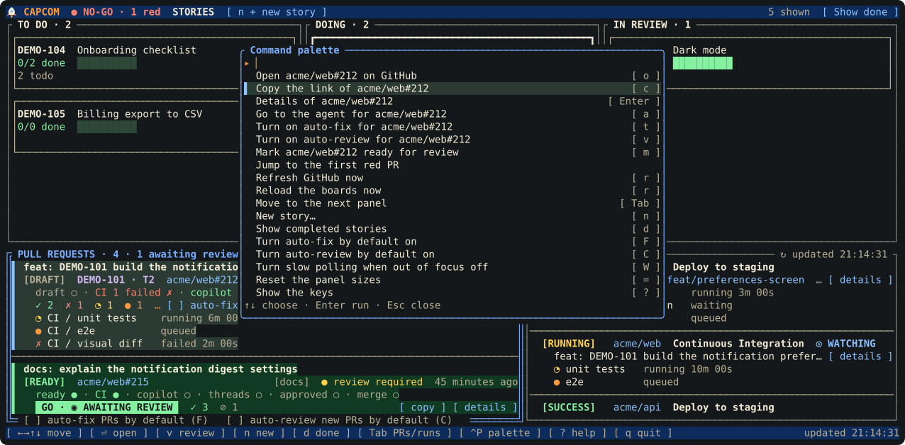
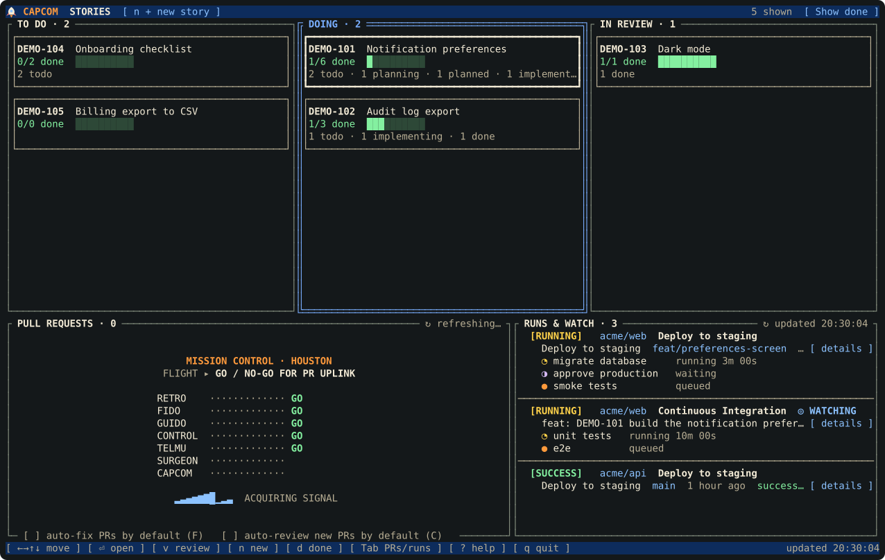

# capcom-tui (CAPCOM's terminal board)


`capcom-tui` is a live kanban view of your stories, your open pull requests and your manual runs. The header carries the 🚀 CAPCOM brand and a go/no-go light: `● GO` when nothing is red, `● NO-GO · 2 red` when some of your open PRs have a failing check or a merge conflict (cancelled runs do not count), and amber `◐ FIXING · 2` when auto-fix has an agent on every red one (`NO-GO · 2 red (1 fixing)` when only some). Click the light to select the first red PR. It reloads on its own whenever a `board.json` changes, so you can leave it open next to the agents that are updating the board. It works with the keyboard and the mouse, and it can start the skills and finish tasks for you (the sections below say how); it only writes to a board when you ask.

```bash
capcom-tui --demo       # try it with invented data: no setup, GitHub or Herdr needed
capcom-tui              # the story list; click or press Enter to open one
capcom-tui PROJ-123     # open a story's board straight away
```

## Story board


The main page is a kanban of your stories in columns **TO DO**, **DOING** and **IN REVIEW** (and **DONE**, which is hidden by default: click `[ Show done ]` in the header or press `d`). A story sits in:

- **TO DO** when it has no task that has left `todo` (including a story with no tasks yet, which has not been broken down).
- **DOING** once any task is planned or under way, up to and including when every task is finished.
- **IN REVIEW** when its story status is `in_review` (set by `/story-review`).

Each card shows the key, title, `done/total` tasks with a progress bar, and a count per task status. Click a card (or press `Enter`) to open the story's board. Narrow terminals (under 80 columns) show a plain list of rows instead.

Drag a card to another column:

- **DOING → IN REVIEW** (or `v`): if every task is `done` or `dropped`, opens a new tab named `review` in the story's Herdr workspace and starts `/story-review KEY`. The skill moves the story to `in_review` itself. Otherwise it says which tasks are unfinished. `v` on a story already in review runs the review again.
- **TO DO → DOING** on a story with no tasks starts `/story-break-down KEY`; on one with tasks it explains that the story moves by itself once its first task leaves TODO.
- **IN REVIEW → DOING** reopens the story; **IN REVIEW → DONE** (with DONE shown) accepts it. Both change the board directly.

## Board

One column per task status (a Dropped column appears only if something was dropped), boxed cards with a status line (ready to implement, waits on dependencies, blocked, PRs merged), the story status in the header, and a detail sheet for the selected card. A card whose task has live pull requests ends its status line with a chip for the worst state among them, so you need not open the panel below: `✗ CI` (a failing check), `⚠ conflict`, `✎ answer` (comments or changes to answer), `◉ review` (green, waiting for a reviewer), `✔ to merge`, `◔ CI` (running) or `✓ CI` (green). Narrow terminals (under 60 columns) show one column at a time.

| Where | Mouse | Keys |
|---|---|---|
| Story board | click a card to open it; drag a card to another column; click `[ Show done ]` / `[ Hide done ]`; wheel moves the selection | `←→` column, `↑↓` story, `Enter` open, `v` review, `d` show or hide done, `n` new story |
| Board | click `‹ Stories` to go back; click a column or card to select it; click the selected card again for its detail; click outside a sheet to close it; wheel scrolls a column | `←→`/`hl` column, `↑↓`/`jk` card, `[` `]` switch story, `Tab` PR panel, `Enter` detail, `Esc`/`b` back to the list |
| PR panel | click a PR to open it on GitHub, a CI stage line to open that check, `[ details ]` for its sheet (each check there has `[ open ]`); wheel scrolls | `Tab` focus, `↑↓` select, `Enter` sheet, `o` open on GitHub, `c` copy link, `m` mark draft ready, `r` refresh (or click the `↻ updated` label) |
| Runs panel | click a run to open it on GitHub, a stage line to open that stage, `[ details ]` for the sheet (each stage there has `[ open ]`); click a tab when narrow; wheel scrolls | `Tab` focus, `↑↓` select, `Enter` sheet, `o` open run, `r` refresh |
| Layout | drag the divider, the top edge of the bottom area, or a kanban column border | `< >` PR panel narrower or wider, `+ -` bottom area taller or shorter, `, .` selected column narrower or wider, `=` reset |
| Anywhere | right-click for a menu | `Ctrl-P` command palette, `r` reload, `W` slow polling when out of focus on or off, `F` / `C` auto-fix and auto-review defaults, `?` help, `q` or Ctrl-C quit |

## Command palette, right-click menu and hover



- **`Ctrl-P` opens the command palette:** one list of every action that fits where you are, each with its key. Type to narrow it (every word you type must appear in the action's name or key), `↑`/`↓` choose, `Enter` runs it, `Esc` or `Ctrl-P` again closes it, and a click runs a line. With the PR panel focused it starts with what can be done to the selected PR (open, copy the link, details, the agent, auto-fix and auto-review, mark ready); on a board it starts with the selected task (plan, implement, finish, details). After those come the things that are always there: jump to the first red PR, refresh, reload, the next panel, new story, the defaults, slow polling, sizes, the keys and quit. It does not open while a question (mark ready, a new story, an agent) is waiting for its answer.
- **Right-click** a PR, or any part of its row, for a menu of what it can do, opened where you clicked, and select the row at the same time; right-click a task card for a menu of its actions; right-click anywhere else for the palette. This reaches the buttons of a one-line (quiet) PR too.
- **Hover:** whatever a click would hit under the pointer lights up (a button is drawn in reverse, a row gets a faint tint), and the footer says what it does (`auto-fix: when CI fails or Copilot comments, ask this PR's agent to fix it (t)`). Moving the pointer only redraws the screen when what is under it changes.
- **Easier to hit:** the space between two buttons on a PR's line belongs to the one before it, so a near miss still lands.

## Pull requests panel

A bottom panel lists your open pull requests with their CI stages, refreshed from GitHub in the background:

- **While the first list loads** the panel shows a 1960s Mission Control "go/no-go" poll instead of a bare message: the Flight Director calls each console in turn (`RETRO`, `FIDO`, `GUIDO`, `CONTROL`, `TELMU`, `SURGEON`, `CAPCOM`) and each answers `GO`, above a sweeping signal strip, ending on `ALL STATIONS GO · AWAITING TELEMETRY` if GitHub is slow. The runs panel has its own scene in the same style, a launch-pad countdown (`LAUNCH CONTROL · CAPE CANAVERAL`): the clock runs from T-minus 10 while the pad checklist (`PAD`, `RANGE`, `GANTRY`, `FUEL`, `COMMS`) is checked off, and if GitHub is slow it holds at `T-MINUS 00:03` as real launches do. Both are decoration, not progress bars (the real status, `↻ refreshing…`, stays in each panel's title). Each appears only for that panel's very first load and only on the story list, and an error or the data replaces it as soon as either arrives. On a short panel a scene shrinks to the one line being checked, and on a tiny one to `STAND BY FOR TELEMETRY`. They redraw four times a second while one shows and not at all afterwards. `capcom-tui --screenshot docs/img/loading.svg --screen loading --size 170x46` draws both.

  
- **Main screen:** *all* your open PRs from the query, including ones unrelated to any story. PRs recorded on a capcom task are tagged `PROJ-123 · T2`.
- **Inside a story:** only that story's PRs (the ones recorded on its tasks), tagged with the task id. A PR that GitHub no longer lists as open (for example a merged one) still shows from the board data.
- **Each row:** the **title on its own full-width line** (it wraps over up to three lines rather than being cut off), then a line with the `[READY]` (green) or `[DRAFT]` (grey) badge, the repo and number, labels, review state, comment count and time since update. A PR that is only known from the board shows `[MERGED]` or `[CLOSED]` instead. Under it a CI summary such as `✓ 12  ✗ 1  ◔ 2  ● 1` (the orange filled circle is pending/queued), then every stage that is still running, queued or failed on its own line, in that order (`◔ CI / build  running 2m 05s`, `● CI / deploy  queued`, `✗ CI / unit  failed 1m 10s`). Passed and skipped stages are only counted; a long list is capped with `… +N more`. A thin line separates one PR from the next.
- **Refreshing and stale data:** while it refreshes, a spinner turns in the panel title (`◜ refreshing…`). If GitHub stops answering the last good list stays and the title says how old it is, in amber: `⚠ stale 5m · last good 18:27`, next to the error in red. The runs panel does the same.
- **Order, on the main page:** by how much each PR needs you, ties in the order GitHub gives: red first (a failing check or a merge conflict), then something to answer (Copilot's comments, changes requested), then waiting for a reviewer, then ready to merge, then checks still running, then the rest. A PR you are on stays under the cursor when the order changes.
- **Quiet PRs are one line.** A PR with nothing to do (a draft with nothing wrong, or a green PR that needs no review) takes a single line (badge, id, title, passed checks, Copilot, age) until you select it, then it opens up like the others. Everything that needs you is always open. The first click on a one-line row opens it up (it does not open GitHub); a click on an open row opens the PR on GitHub as before.
- **The rail:** every PR has one line showing its way to a merge, `ready ● · CI 1 failed ✗ · copilot ● · threads 2 ✗ · approved ○ · conflicts ✗`, where each step is a word and an icon (`●` done, `◔` going, `✗` wrong, `○` not yet), and a running CI says how long it has left (`CI ~2m left ◔`, see below). When the panel is too narrow, steps that are done go first, then those not reached yet; what is wrong or going stays.
- **Waiting for a reviewer:** a PR that is out of draft, has every check passed (skipped and neutral ones do not count against it, a cancelled or failed one does) and has no review yet is lit up like a flight controller's "GO": a solid green `GO · ◉ AWAITING REVIEW` block at the start of its CI line, a green bar down its left edge and a dark green tint across the whole row (the words carry the meaning, so it reads without colour), and the panel title counts them: `PULL REQUESTS · 5 · 2 awaiting review`. They are listed ahead of everything that needs less. When a PR newly turns green and waiting for a reviewer, capcom shows a status line and sends a desktop notification through `notify-send` (if installed): `CAPCOM: PR green, needs a reviewer` with the repo, number and title. Starting the TUI does not announce PRs that were already waiting, a PR is announced once per time it becomes ready (green again after a failure counts), and each open copy of the TUI notifies on its own. An approved all-green PR shows `✔ APPROVED · READY TO MERGE`, and one in a repo that needs no review shows `✔ ALL GREEN`. Drafts, PRs with changes requested and anything still running or failing get none of these. The detail sheet adds a `Waiting` line saying the same in words.
- **Time left:** a running check shows what it has taken against what it usually takes, `◔ CI / e2e  running 2m 05s of ~4m`, or `running 9m 10s · usually ~4m` once it runs long. The "usually" is the middle of the last five times that check passed in that repo, learned as capcom sees checks finish and kept in `~/.cache/capcom/check-durations.json` (a few kilobytes, tidied when it grows). A check with no history shows only its time so far.
- **Merge conflicts:** a PR whose branch conflicts with its base shows `⚠ merge conflicts` in red on its summary line, even when every check is green, and with auto-fix ticked the agent is asked to fix it (the `/pr-address` skill merges the default branch in and resolves mechanical conflicts) once per state, like a failing check. A branch that is merely behind its base shows `↓ behind the base` and is not asked about: it changes whenever the base moves, so it would mean an ask for every merge.
- **Copilot:** on each of your PRs the summary line ends with Copilot's part: `copilot ◔ reviewing` once a review is requested, then `copilot ✎ 3 to fix` (unresolved conversations it started) or `copilot ✔ reviewed`. When its review arrives capcom shows a status line and sends a desktop notification (`CAPCOM: Copilot finished reviewing`, with the number of comments to address). A PR first seen already reviewed, and everything on startup, stays quiet.
- **Auto-fix and auto-review are ticked per PR.** Every PR of yours has two ticks on its button line: `[ ] auto-fix` and `[ ] auto-review` (click them, or press `t` and `v` on the selected PR). The choice is remembered per PR in the settings file and forgotten once the PR is gone; a tick on one PR never affects another.
  - **auto-fix:** capcom asks the agent that made the PR to fix it, by sending `/pr-address <url>`, whenever it has a failing check (once its GitHub Actions checks have settled; cancelled runs do not count, and a status another service leaves pending does not hold it back) or unresolved comments from Copilot (once its review is in). Ticking a PR that is already red asks straight away. That skill (in `skills/pr-address`, works on any PR) merges the default branch into the PR branch, fixes real CI failures, fixes or declines each unresolved comment with a reason, pushes once, then replies to and resolves the conversations it dealt with and reports what it did. It never force-pushes, merges, or changes draft/ready. The agent is found the way `[ agent ]` finds it: the running agent if it is idle (a busy one is not interrupted), else its session resumed, else a fresh agent started in `<CAPCOM_WORKDIR>/<repo name>`. capcom asks **once per state of the PR**: it asks again only when the PR has changed since (a new commit, other failing checks, other open comments), which is what makes "keep going until green" safe. It gives up after 5 automatic rounds on a PR and tells you; if the PR does not change 10 minutes after an ask it tells you the agent may be stuck. To start the count again, untick and tick auto-fix on that PR. The row shows `⟳ fix round 2/5 sent 3m ago`. What it has asked is kept in `~/.cache/capcom/autofix.json` under a lock, so a restart or a second open copy never asks twice.
  - **auto-review:** capcom asks Copilot to review the PR (`gh pr edit --add-reviewer @copilot`) the first time it sees it with no Copilot review, once per PR. Ticking it on a PR with no review asks at once, even if Copilot was asked about that PR before.
  - **Defaults:** two boxes along the bottom edge of the panel (click, or press `F` and `C`) set what a PR with no tick of its own does: `auto-fix PRs by default (F)` and `auto-review new PRs by default (C)`. A PR's own tick always wins.
- **Click and details:** clicking a PR opens it on GitHub, and clicking one of its CI stage lines opens that check. The `[ details ]` button at the right of its CI line (or Enter on the selected row) opens the full sheet, where every check that has a link has its own `[ open ]` button: draft or ready for review, every check grouped running, queued, failed, passed, with durations. `o` (or the button) opens the PR in your browser.
- **Copy and ready:** `[ copy ]` (or `c`) puts the PR link on your clipboard (through the terminal and, when installed, `wl-copy`, `xclip` or `pbcopy`). Clicking a `[DRAFT]` badge (or `m`) asks "Mark ready for review?" and, on yes, runs `gh pr ready` for that PR; the panel then refreshes.
- **Back to the agent:** a PR recorded on a task has an `[ agent ]` button (or `a`) that takes you to the Claude Code session that made it, inside Herdr. If that agent is still running (found by its Herdr session, or by the name the board gave it) it is brought to the front. Otherwise the session recorded on the task is resumed with `claude --resume` in a new tab of the story's workspace, started in the directory the session began in. `/story-plan-task` and `/story-implement-task` record their session with `capcom set-session` (the id comes from `$CLAUDE_CODE_SESSION_ID`); the implementing session is preferred. A task with no recorded session and no running agent says so. A PR that is on no task and that no session made has no button.

  **PRs made outside the workflow:** Claude Code writes a `pr-link` entry into a session's transcript (`~/.claude/projects/*/<session>.jsonl`) whenever that session creates a PR. A background thread reads those entries (only the new part of each transcript, keeping its index in `~/.cache/capcom/pr-links.json`) and gives every PR it finds an `[ agent ]` button, whatever repo it is in. One agent that made PRs in several repos is the same session behind each of them; if a PR is linked from several sessions the earliest one, the one that made it, wins. Nothing is sent anywhere. Resuming opens the tab in the Herdr workspace you are in, in the folder the transcript is stored under (so a session that moved into a worktree resumes from the worktree; if that worktree has been deleted, it says so).
- **Keys:** `Tab` moves focus to the panel and back, `↑↓` select a PR, `Enter` opens the sheet, `o` opens it on GitHub, `r` refreshes now, and so does clicking the `↻ updated` label in a panel title. The mouse works too: click a row, click it again for the sheet, scroll over the panel.

The PR panel fetches with one GraphQL call, plus a second small one for the PRs Copilot has reviewed, to read their conversations (if that one fails the list still shows, without the conversation counts). capcom makes its GitHub calls itself, over one connection it keeps open, authenticated with the token `gh auth token` prints (read once, kept in memory, sent only to `api.github.com`; set `CAPCOM_NO_NATIVE_HTTP=1` to use the `gh` command for everything instead, and it also falls back to `gh` by itself when the direct route cannot work, for example behind a proxy it cannot use or with another GitHub host). GitHub charges GraphQL by the largest answer a query could return, not the one it did, so the list query leaves the conversations out: asking for them inside it cost 28 points a poll, enough to use up the 5,000-point hourly budget in under 20 minutes, while the list now costs 2 points and the conversations lookup 1 (both measured with GitHub's own `rateLimit` field). It polls about every 5 seconds while a GitHub Actions check is running or queued and about every 30 seconds otherwise. A status another service leaves "pending" (such as a visual review waiting for you to accept it) neither speeds polling up nor holds back auto-fix. Each answer reports what is left of the hourly budget; capcom spaces its polls out as it runs low, and when it is spent it stops until GitHub resets it and the panel says when (for example `GitHub's hourly GraphQL budget is used up; capcom waits until 18:53`). The checks on PRs that are not in your open list use the REST API, which has a separate budget. Nothing from GitHub is written to disk: PR data lives in memory only. If a fetch fails, the last data stays and the error shows in the panel.

The query defaults to `is:pr author:@me state:open archived:false sort:updated-desc -label:icebox`. Change it with `--pr-query "..."` or `CAPCOM_PR_QUERY`. `--no-prs` turns the panel off (for example when `gh` is not installed). On a short terminal (under about 16 rows) the panel is hidden.

## Runs and watch panel

Next to the pull requests panel (side by side when the terminal is about 150 columns wide or more, otherwise as a second tab, `[ Pull requests · 3 ]  [ Runs & watch · 2 (1 active) ]`, with a live count of active runs) is a panel of GitHub Actions runs you are following: the ones *you* started by hand (the "Run workflow" button, `workflow_dispatch`), such as a manual nonprod deploy, and any run you **watch**.

- **Watching a run:** paste a link to it anywhere in capcom-tui, for example `https://github.com/acme/web/actions/runs/123` (a link to one of its jobs works too). It joins the list marked `◎ WATCHING` with its stages, in any repo and whoever started it, so you no longer need to keep refreshing the GitHub page. What you watch is remembered in `~/.config/capcom/tui.json`, so it survives a restart. `x` on a run in the panel stops watching it.
- **Told when it finishes:** when a run that was running while you watched finishes (green, failed or cancelled) capcom rings the terminal bell, shows a line such as `✔ acme/web run 123 is GREEN: <title>` and, if `notify-send` is installed, sends a desktop notification. This applies to your manual runs too. A run first seen already finished does not alert.
- **Falls off the panel:** a finished run leaves the panel 30 minutes after it finished (a watched run you add after it finished stays 30 minutes from when you added it). Anything still running stays.

- **Which repos:** GitHub cannot list your runs across repos, so the tool asks each repo in turn. The repos are the ones from your open PRs, the PRs recorded on your stories' tasks, and any you add with `CAPCOM_DEPLOY_REPOS=org/a,org/b` (or `--deploy-repos`). Inside a story it shows only runs in that story's repos.
- **Each run:** a `[RUNNING]`, `[WAITING]` (needs approval), `[QUEUED]`, `[SUCCESS]`, `[FAILED]` or `[CANCELLED]` badge, the repo, the workflow name, the run's title, branch, time since it started and how long it ran. Stages that are running, waiting, queued or failed are listed one per line underneath (running first), like the CI stages on a PR. Successful runs show no stages.
- **Click through (same as the PR panel):** click a run to open it on GitHub, click any stage line to open that stage, and click `[ details ]` (or press Enter) for the full sheet. Every stage in the sheet has its own `[ open ]` button, and `o` opens the selected run.
- **Timeliness:** one REST call per repo (run in parallel) about every 10 seconds while any of your runs is active and about every 30 seconds otherwise, plus one call per active or failed run for its stages (finished runs are cached). A finished run (success, failed or cancelled) drops off 30 minutes after it finished; anything still active always stays. Watched runs are fetched by id (one call each, plus one for the stages while active or failed), shared between open copies through the same cache. `r` refreshes now, and so does clicking the `↻ updated` label in a panel title.
- **Off switch and keys:** `--no-runs` turns it off. `Tab` moves focus main, pull requests, runs; `↑↓` select; the wheel scrolls.

## Sizing

When there are no runs (or the panel is switched off), the runs panel shrinks to a narrow strip and the PRs get the room; it grows back as soon as there is a run, an error or a warning to show. Every panel can be resized, by mouse or keys: drag the divider between the PR and runs panels (also when the runs panel has shrunk; a size you choose is then respected even when it is empty), drag the top edge of the bottom area up or down, and on a board drag the border between two kanban columns. With the keys, `<` `>` make the PR panel narrower or wider, `+` `-` make the bottom area taller or shorter, and `,` `.` make the selected kanban column narrower or wider; `=` resets everything to automatic. **The sizes are saved** and restored the next time you start, in `~/.config/capcom/tui.json` (or `$XDG_CONFIG_HOME/capcom/tui.json`; set `CAPCOM_TUI_SETTINGS` to use another file). The file holds only those numbers, lives outside any repo, and a missing or damaged file just means the defaults.

## Herdr

Started inside a Herdr pane, `capcom-tui` can launch the skills for you (outside Herdr these are off and say so):

- **New story:** press `n` (or click `[ n + new story ]`) on the story list, paste a Jira key or link and press Enter. A Herdr workspace named after the key is created and `/story-break-down KEY` starts in it; once the story has a title, the breakdown skill renames the workspace to `KEY - a few words` (see below).
- **Drag to start:** drag a TODO card onto PLANNING to start `/story-plan-task KEY T2`, or a TODO or PLANNED card onto IMPLEMENTING for `/story-implement-task KEY T2` (it must have its dependencies done; a TODO card skips planning, handy for spikes and manual testing, and first asks "Does an agent need to implement this?": yes starts the agent, no just moves the card to IMPLEMENTING and opens nothing, for work you do yourself). `p` and `i` do the same for the selected card. Each runs in a new tab of the story's workspace; the drag itself changes nothing, the skill moves the card as its first step. Dropping on any other column explains why nothing started.
- **No double starts:** agents are named like `proj-123-t2-plan`; if one is already running it is brought to the front instead.
- **Workspace names:** a story's workspace is called its key, a hyphen and the first few words of its title, for example `PROJ-123 - Notification preferences` (at most three words and 28 characters, without trailing filler like "to" or "the"). A workspace that is still named just `PROJ-123` is found and renamed the next time something launches from the board.
- **Where they run:** the current folder of `capcom-tui`, or `--workdir` / `CAPCOM_WORKDIR`. Nothing about Herdr is stored: workspaces are found again by their key at the start of their label.

## Finishing tasks

A merged PR does not update `board.json` by itself, so the TUI helps:

- **Drag to DONE (or `x`):** an IMPLEMENTING card dropped on DONE looks up its recorded PRs on GitHub, records what it found, and moves the task to done only if every PR is merged (a spike or decision with no PRs just finishes). Otherwise it says which PR is still open, for example `T2 is not done: #1294 is still open`. No agent starts. When it was the story's last task, the message points at `/story-review KEY`.
- **Hint on the card:** an IMPLEMENTING card whose PRs are all merged on GitHub shows `✓ all PRs merged · drag to DONE`. The TUI checks recorded PRs that are not in your open list every minute, in the background (one `gh pr view` per PR, shared between open copies through the cache), and only writes when you ask.
- **Cleanup question:** if the task's `## Progress` notes record a worktree path, finishing asks "Does an agent need to clean up its worktrees?": yes starts `/story-implement-task KEY T2` (its cleanup step), no does nothing.
- **`R`:** syncs the whole open story, the same as `capcom refresh KEY`: every PR's state is recorded and tasks whose PRs are all merged finish.
- **`S`, auto-sync (off by default, remembered):** turns on writing what the background check finds to the board by itself, so a merged PR finishes its task without you doing anything. `⟳ AUTO-SYNC` shows in the header while it is on.

## More than one PR per task

A task's `repos` list says which PRs it expects: list a repo once per PR. `--repos api,api,ui` means two PRs in `api` and one in `ui`. The task cannot finish until every expected PR exists and is merged, so the card reads `● merged · needs a PR in api` and drag-to-DONE refuses with `waiting for PRs in: api` until the second one is recorded (`capcom add-pr`, which the implement skill does for each PR it opens). Cards show `api ×2`.

## Several copies, one poll

Every open `capcom-tui` (a terminal and the Herdr plugin, say) shares one cache in `~/.cache/capcom/` (`$XDG_CACHE_HOME/capcom`, or `CAPCOM_CACHE_DIR`). A copy fetches from GitHub only when the cached data is older than the polling interval (5 s busy / 30 s idle for PRs, 10 s / 30 s for runs); a lock makes sure only one copy fetches at a time and the others reuse the result. A manual refresh (`r` or the `↻ updated` label) fetches at once, unless some copy fetched in the last 3 seconds. There is no daemon: when every copy is closed, nothing polls. Copies with a different `--pr-query` or repo list keep separate entries. Cache files are private to your user and are tidied after a day.

## Idle cost

An idle board does very little: it redraws only when something changed (a key, a click, new data, a reload) and otherwise only every second while something on screen counts time (a running check or run, a status line) or every 30 seconds for the "ago" texts, and it notices a changed `board.json` by checking each file's size, modification time and inode instead of reading it. **When you are elsewhere it polls far less:** if the terminal reports that its window lost focus, or Herdr says another pane has focus (capcom asks Herdr every 5 seconds, using `HERDR_PANE_ID`), the PR and runs feeds wait four times longer, and never less than a minute, so a running pipeline is checked every minute and an idle board every two. The header shows `☾ AWAY · slow polling`, and coming back refreshes at once. Alerts and auto-fix still happen while you are away, up to a couple of minutes later. If you watch the board from a pane beside the one you work in, press `W` to turn this off (it is remembered). When neither the terminal nor Herdr can say, the board counts as being looked at. Calls to GitHub are made from inside capcom over a connection it keeps open, about 2 ms of CPU each; starting the `gh` command for every call cost about 150 ms.

## Herdr plugin

The repo is also a Herdr plugin (`herdr-plugin.toml`) with one action, `capcom.open`: it opens the TUI as an overlay, or focuses the copy already open in the current workspace.

```
herdr plugin install philals/mission-control-capcom        # from GitHub: builds and installs capcom and capcom-tui (needs Rust)

# or, from a checkout of this repo:
cargo install --path . --locked            # puts capcom-tui on your PATH
herdr plugin link /path/to/capcom          # registers the plugin from this folder
```

The install step (`scripts/install.sh`) runs `cargo install` into `~/.local/bin`. The plugin is listed on the [Herdr marketplace](https://herdr.dev/plugins/) once the repository is public and tagged with the `herdr-plugin` topic.

Then bind a key in Herdr's `config.toml`:

```toml
[[keys.command]]
key = "prefix+y"
type = "plugin_action"
command = "capcom.open"
description = "open capcom"
```

Put the TUI's settings in the plugin's own config folder (`herdr plugin config-dir capcom`), in a file called `env` with one `KEY=VALUE` per line, for example `CAPCOM_ROOT=...` and `CAPCOM_WORKDIR=...` (Herdr's own environment is not your shell's).

## Colours

`capcom-tui` paints its own fixed dark theme in 1960s space-programme colours (console charcoal, cream text, a NASA-blue title and key strip, amber and orange lamps, phosphor green), so it looks the same whatever your terminal background or colour scheme is, for example a background that changes per folder. Every text colour keeps at least a 4.5:1 contrast ratio against its background, which a test checks on every screen and dialog. State is never shown by colour alone: pull requests say `[READY]` or `[DRAFT]`, and every CI stage has an icon and a word. The focused panel (or selected column) also gets a double-line border, so focus is not shown by colour alone.

It needs `CAPCOM_ROOT` or `--root` like the `capcom` tool (not with `--demo`). While it runs, the terminal's own text selection is replaced by mouse clicks (hold Shift to select text in most terminals).
